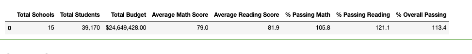
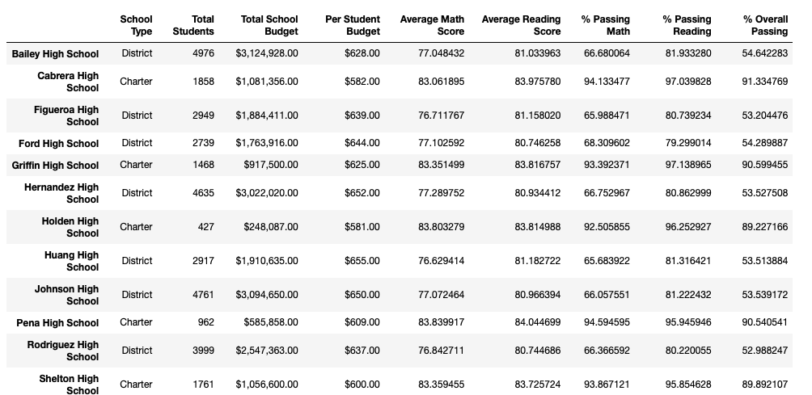
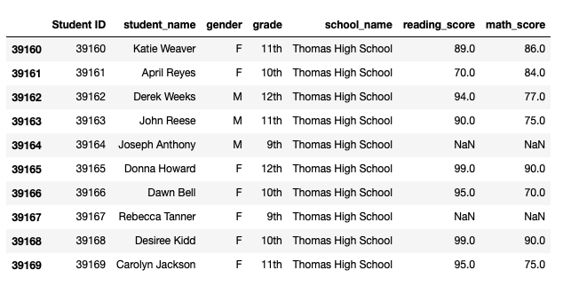
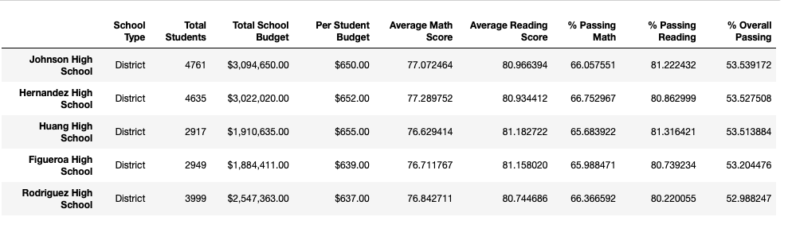
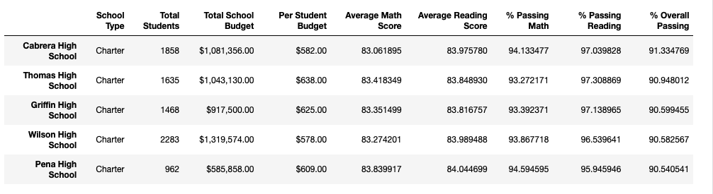
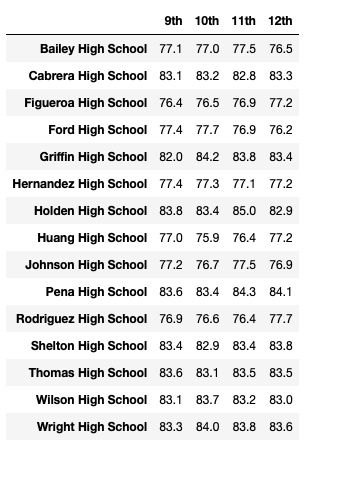

# School_District_Analysis

* Use Python and Pandas library to analyze school distrct data and showcase trends in school performance based on key metrics.
* Use Jupyter Notebook to visualize data outcomes as table format.

* This analysis assists the school board and district level in making desicions of budgets and priorities.

## The process of project

* Read raw data in csv file.
* Clean and inspect data, correct inappropriate data.
* Merge datasets to create new DataFrame gathering more information.
* Perform calculations  for key metrics use groupby() function.
* Visualize data with tables to tell story and showcase trends.

# Project Goal

Comparing two analysis results after removing the ninth-grade math and reading scores from Thomas High School, make cohesive conclusions in Jupyter Notebook.

## Conclusion

After removing the ninth-grade math and reading scores from Thomas High School, it affacts summary tables by slightly reducing the average scores and enomous decreasing for the passing percentage rate, including both math and reading passing percentage as well as overall passing percentage.

## Project Results

### The District school summary

Here passing reading % is higher than Math%

-----------------------

### The School Summary

### The Table repacing 9th Graders

### Bottom 5 

The bottom 5 schools taking overrall passing % after the analysis

### Top 5

The Top 5 schools taking overrall passing % after the analysis

### Math Reading Scores

